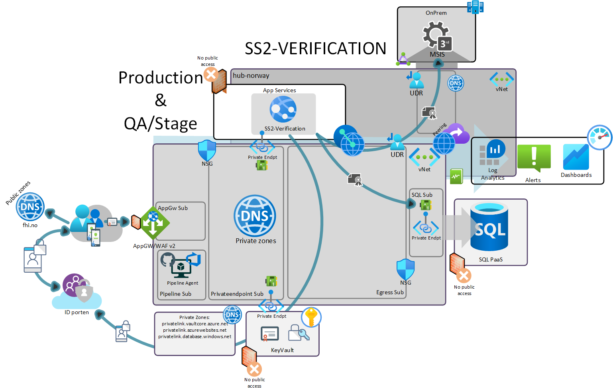
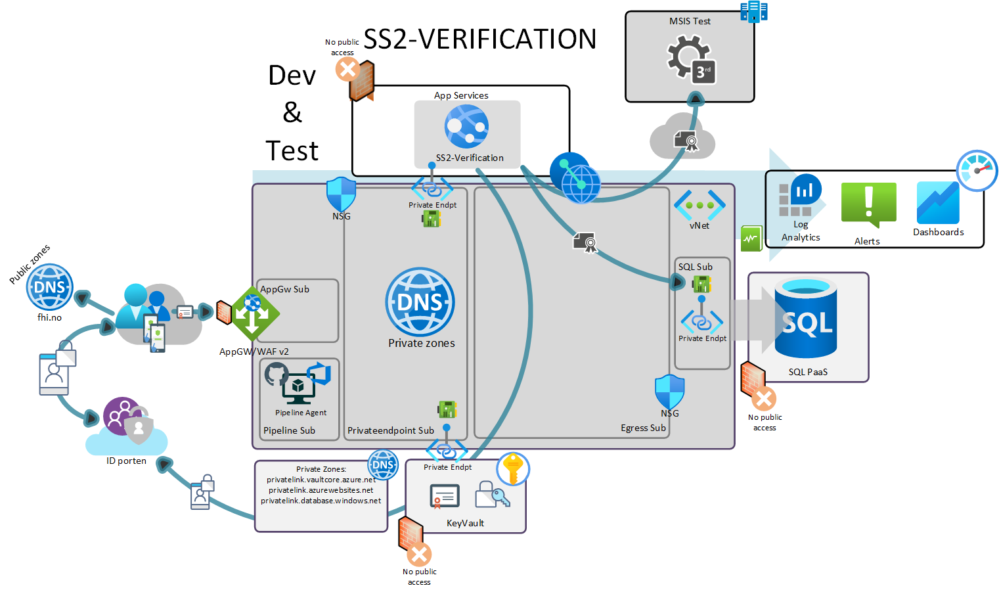
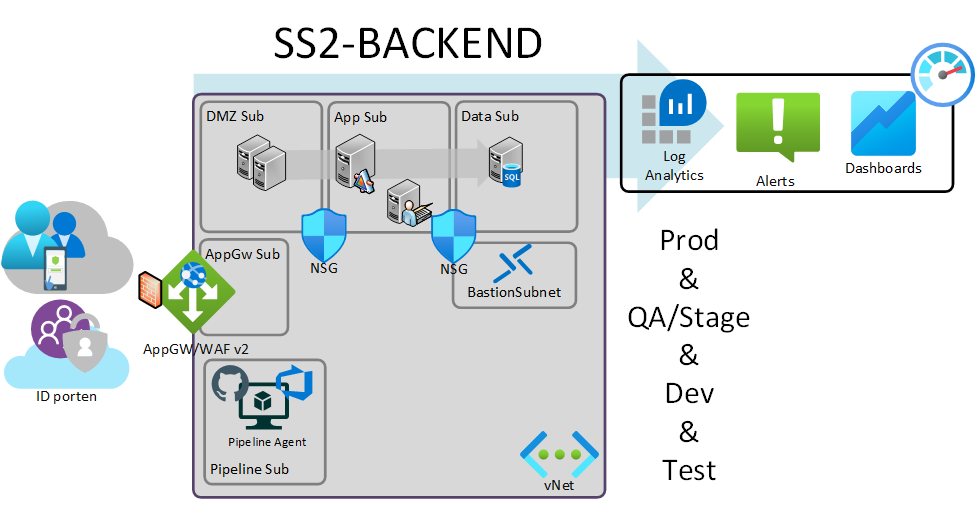
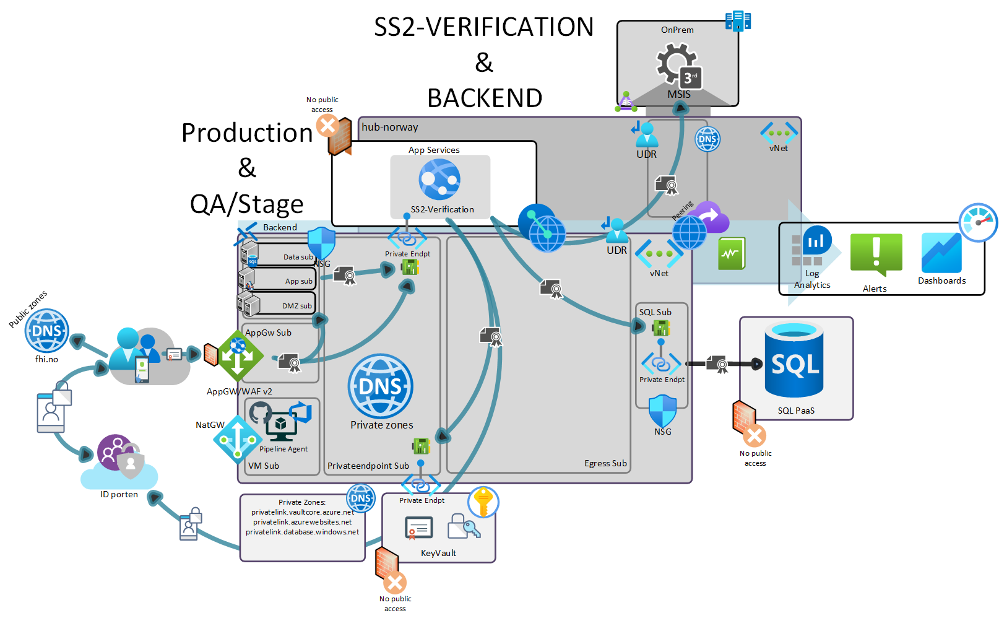
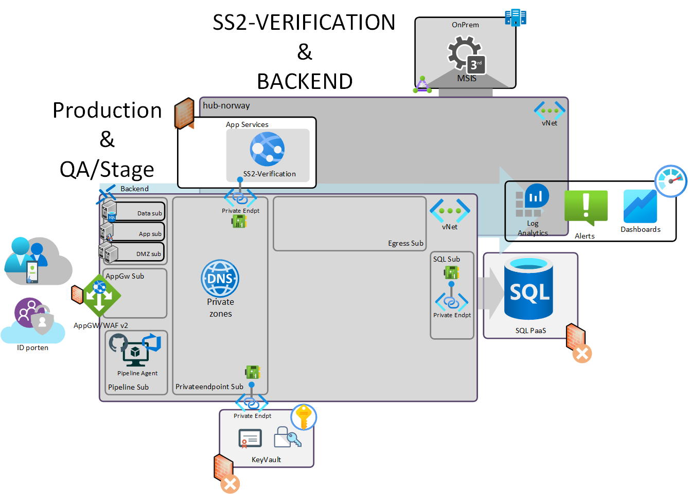
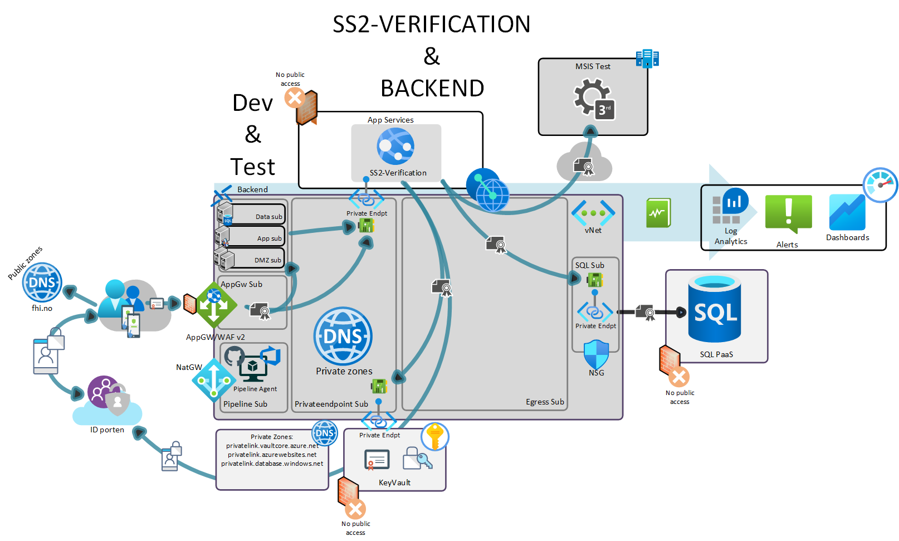
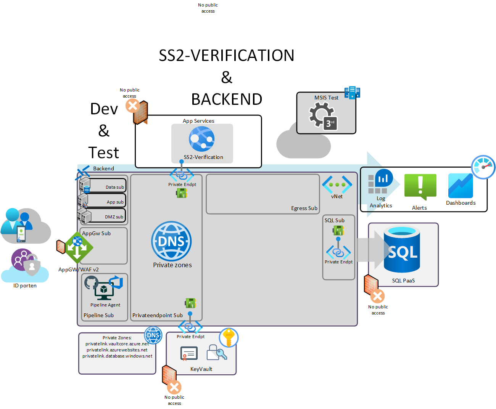

# Azure

## Ressursgrupper

Løsningene deles opp i følgende grupper med roller/rettigheter knyttet inn på RG-nivå

Verifikasjon:  
rg-ss2-vl-dev/test/qa/prod

Backend:  
rg-ss2-be-dev/test/qa/prod

Delt:  
rg-ss2-shared-dev/test/qa/prod

Delt RG vil typisk inneholde tjenester man ikke ønsker at forvaltere av løsningen skal ha tilgang til. Eksempel på dette er det virtuelle nettverket, keyvault og delt lagring.

## Navnestandard

Eksempel på navngiving for verifikasjon:

AppService:  
app-ss2-vf-dev/test/qa/prod

AppServicePlan:  
plan-ss2-vf-dev/test/qa/prod

Azure SQL server:  
sqlserver-ss2-vf-dev/test/qa/prod

Private endpoint app service:  
privateendpoint-ss2-vf-app-dev/test/qa/prod

Private endpoint sql:  
privateendpoint-ss2-vf-sql-dev/test/qa/prod

Eksempel på navngiving for delte ressurser:

Application Gateway:  
appgw-ss2-shared-dev/test/qa/prod

Storage Account:  
stss2shareddev/test/qa/prod

Virtual Network:  
vnet-ss2-shared-dev/test/qa/prod

## Avklareringer

Viktige avklareringer for integrasjon mellom løsningene og 3.part:

- Omforent DNS som fungerer for alle tjenester og integrasjoner som er del av vNet eller utenfor
- Sertifikat offentlig og internt
- Pipelines som kan nå nedlåste tjenester
- Sikring av hemmeligheter og sertifikat
- Trafikk mønster og ruting for å nå 3.part

Forvaltningstjeneste behov for type tjenester PaaS / IaaS. Innkludert behovene for de forskjellige miljøene.

# SS2-Verifikasjon

Produksjon & QA/Staging (med koblinger):  

Andre miljø:  

# SS2-Backend

# SS2 Verifikasjon & Backend delt nettverk

Produksjon & QA/Staging (med koblinger):  

Produksjon & QA/Staging (uten koblinger):  

Andre miljø(med koblinger):  

Andre miljø (uten koblinger):  

