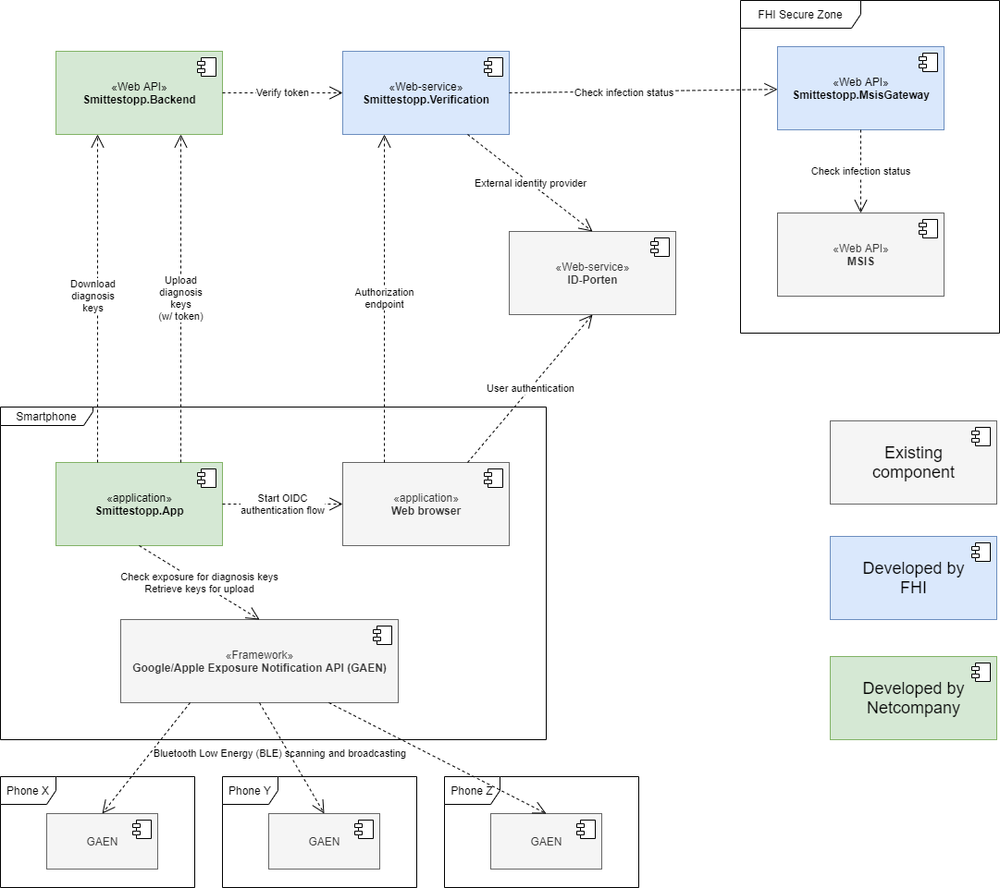

# Smittestopp (NO exposure notification app)

## Components overview

An overview of the different components involved in the Smittestopp application is illustrated by the diagram below.

The solution consists of a number of new components created specifically for this solution

- Smittestopp Backend
- Smittestopp App
- Smittestopp Verification

In addition, the solution reuses a number of existing components/solutions

- [Google/Apple Exposure Notification API (GAEN)](https://en.wikipedia.org/wiki/Exposure_Notification)
- [ID-porten](http://eid.difi.no/en/id-porten)
- [Norwegian Surveillance System for Communicable Diseases](https://www.fhi.no/en/hn/health-registries/msis/)

The [processes and data flows for exposure notification](gaen-processes.md) between the different components are covered in more detail in a [separate document](gaen-processes.md).

### Smittestopp backend

The central backend responsible for distributing the diagnosis keys used by the app to detect exposures.

### Smittestopp app

The application running on each user's phone, responsible for activating the Exposure Notification framework to start the distributed contact tracing, receiving diagnosis keys from the backend to check for exposure, and uploading diagnosis keys upon verified infection for the user.

### Smittestopp verification

The solution responsible for verifying the infection status of a user and granting access to notifying their contacts of exposure. 
[The source code for the verification solution can be found on github here](https://github.com/folkehelseinstituttet/Fhi.Smittestopp.Verification). The verification is done by first authenticating the user through [ID-porten](http://eid.difi.no/en/id-porten), and then performing an infection status lookup in MSIS ([Norwegian Surveillance System for Communicable Diseases](https://www.fhi.no/en/hn/health-registries/msis/)).

