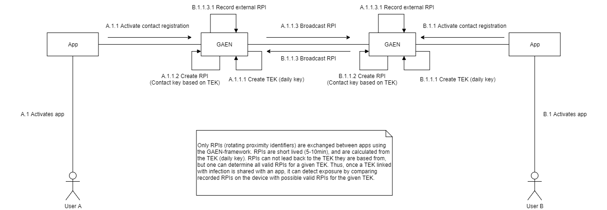
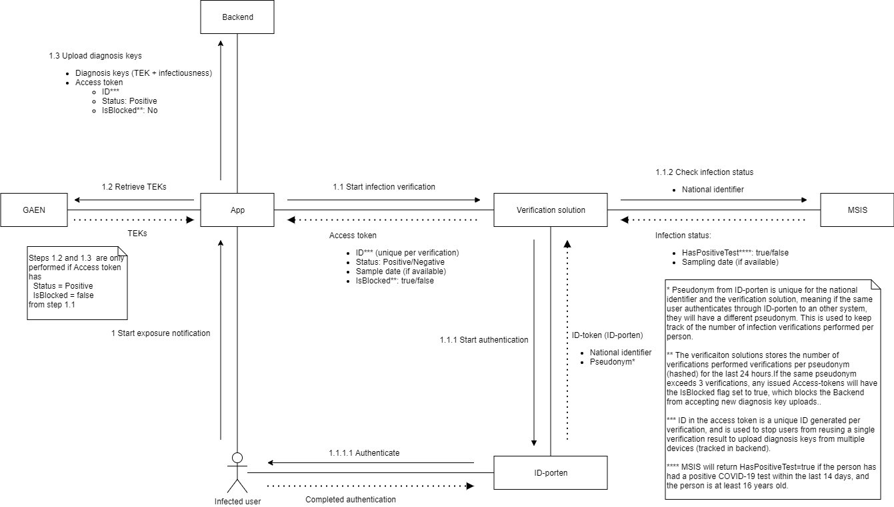
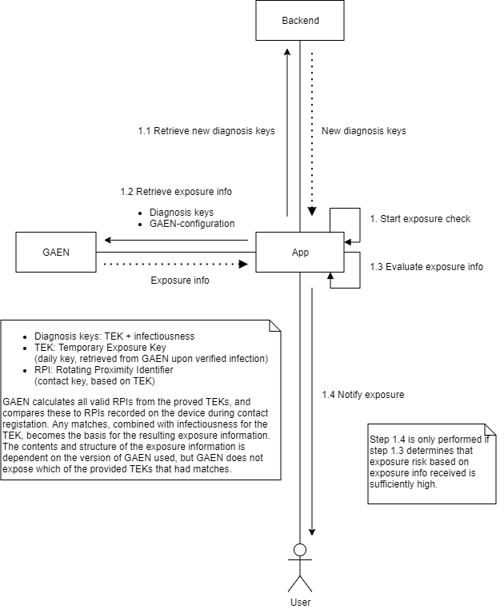

# Exposure Notification Processes

This document describes the processes, related to GAEN, used in the app to perform distributed contact registration, letting an infected user notify their digital contacts, and notifying app users of exposure.

## Distributed contact registration

The figure below illustrates how the distributed contact registation works between two different users of an app using the GAEN-framework.

Once activated through consent from the user, the apps will generate daily keys called Temporary Exposure Keys (TEKs).
From these keys, a Rotating Proximity Identifier (RPI) is generated every 5-10 minutes.
The RPI is then broadcasted through Bluetooth Low Energy to all other devices listening for the same service ID.
The broadcasted RPIs are detected by other devices through frequent scanning, and is recorded on the device, along with timestamp and signal strength.
This information can later be used to detect exposure from any TEKs linked to infection shared with the device.

## Verify infection and notify exposure

The figure below illustrates how a user can notify their digital close contacts through the application.

Once a user has been informed that they have tested positive for COVID-19, they may start the notification process through the app.
The first step of this process is to verify the infection status of the user.
To start this process, the user has to give an additional consent to the app.
Given consent, the app opens up the verification solution, where the user will be asked to authenticate through ID-porten.
After successful authentication, the verification solution performs a lookup in MSIS on behalf of the authenticated user, using the national identifier provided by ID-porten, to verify that there exists a valid positive test result.
To successfully verify infection status, the user must be at least 16 years of age, and have a positive COVID-19 test result with the sample taken within the last 14 days.

The verification solution keeps track of how many verifications have been performed by the same user within the last 24 hours.
If a user has exceeded 3 verifications in the relevant time period, they will be flagged as blocked from performing the actual notification process.
The performed verifications are recorded using a hash of the pseudonym provided from ID-porten.

Once the verification is completed, the user is returned to the app with an access token containing both the information needed by the app to continue the process, as well as the necessary claims to perform an upload of diagnosis keys to the central backend.

If the verification either does not confirm infection status, or has flagged the user as blocked, the app will display a relevant error message and end the process.
Otherwise, the app will ask the user for some additional information to continue the process.
The user is asked to provide the date of onset of symptoms, which is used to assign infectiousness scores to each TEK to be uploaded.
If no date of symptoms is used, the sample date is used instead.

The app then retrieved all TEKs for the last 14 days from GAEN, combines these with infectiousness info to create diagnosis keys, and uploads this to the central backend, with permissions granted through the access token from the verification solution.

## Detecting exposure

The figure below illustrates the process for detecting and notifying a user of exposure.

Through the GAEN-framework, the app makes sure that en exposure check is performed periodically (typically a few times a day).

The first step is to retrieve new diagnosis keys (TEKs + infectiousness) from the central backend solution.
These new keys are then provided to the GAEN-framework, and together with any diagnosis keys provided earlier, exposure information is proveded to the app.
The way GAEN determines exposure is by calculating all valid RPIs for all TEKs provided, and then looking for matches with RPIs recorded on the device during contact registation.
For any matches, the time period a contact was recorded for, the estimated distance to the device emitting the RPI (based on signal strength), and the infectiousness value for the relevant TEK is used to determine the risk value.
In addition to risk values, the exposure information from GAEN includes rough information about duration, time of contact, etc., for qualified exposures, according to the configuration provided by the app.

The app itself then evaluates this exposure information to determine if there has been any exposures of sufficient risk, and decides if the user should be notified of exposure or not.

If exposed, the user receives a notification, which leads them to the app where they can find up to date information and recommendations for what to do.

